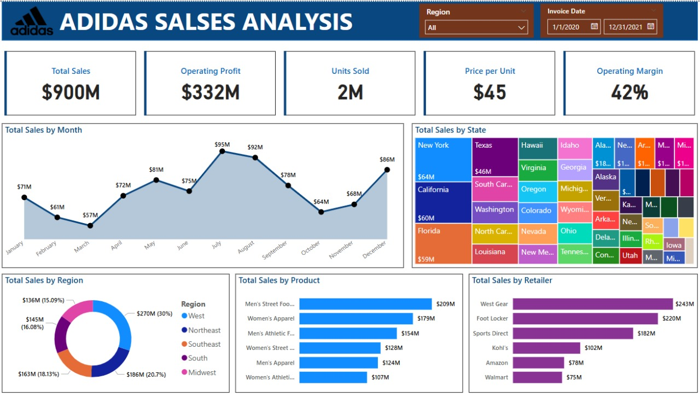

# Adidas Sales Performance Dashboard 📊

This project presents a comprehensive **Power BI dashboard** analyzing **Adidas US sales performance** between 2020 and 2021. It highlights key metrics such as total sales, units sold, operating profit, and profit margins. The dashboard enables dynamic insights into product categories, regional performance, and retailer contributions.

---

## 📁 Files Included

- `Adidas Sales.pbix` — The full Power BI project file.
- `Adidas US Sales Datasets.xlsx` — The dataset used for analysis.
- `DASHBOARD.jpg` — A static image of the final dashboard.
- `Adidas_logo.png` — Logo used in the report visuals.

---

## 🔍 Key Insights

- 💰 **Total Sales**: $900M  
- 📦 **Units Sold**: 2M  
- 📈 **Operating Margin**: 42%  
- 🏆 **Top Product**: Men's Street Footwear ($209M)  
- 🛍️ **Top Retailer**: West Gear ($243M)  
- 🌎 **Best Performing Region**: West  

---

## 📌 Dashboard Features

- KPI Cards (Total Sales, Units Sold, Price/Unit, Margin)
- Monthly Sales Trend Line
- Sales by Region (Donut Chart)
- Sales by State (Treemap)
- Sales by Product Category (Bar Chart)
- Sales by Retailer (Bar Chart)
- Interactive filters (Region & Invoice Date)

---

## 🧠 Skills Demonstrated

- Power BI Dashboard Design  
- Data Modeling & Relationships  
- Data Cleaning with Power Query  
- DAX Measures & Calculated Columns  
- Business Analysis & Storytelling  
- Slicers and Interactivity  

---

## 📊 Tools Used

- **Power BI**
- **Excel**
- **Power Query**
- **DAX**

---

## 📌 About the Dataset

The dataset contains detailed information about Adidas product sales in the United States, including:
- Product categories
- Retailers
- Sales figures
- Profit, quantity, region, and more.

---

## 💡 Feel free to star ⭐ this repo if you found it useful!
